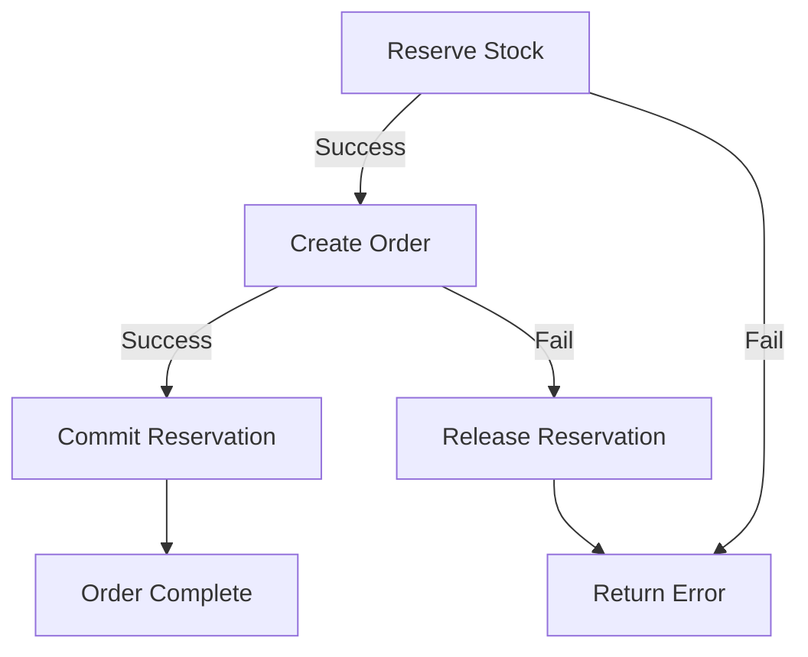

# Transaction Patterns & Best Practices

**Version:** 2.0  
**Last Updated:** 2025-12-28

---

## 📋 Table of Contents

1. [Transaction Basics](#transaction-basics)
2. [Pessimistic Locking](#pessimistic-locking)
3. [Stock Reservation Pattern](#stock-reservation-pattern)
4. [Order Creation Flow](#order-creation-flow)
5. [Error Handling & Rollback](#error-handling--rollback)
6. [Common Pitfalls](#common-pitfalls)

---

## Transaction Basics

### Initialization

**CRITICAL:** Must be first line in `main.ts`:

```typescript
import { initializeTransactionalContext } from 'typeorm-transactional';

async function bootstrap() {
  // 🔥 MUST BE FIRST - Before creating NestJS app
  initializeTransactionalContext();

  const app = await NestFactory.create(AppModule);
  // ... rest of setup
}
```

---

### When to Use @Transactional

**✅ ALWAYS USE on write operations:**

```typescript
@Transactional()
async create(dto: CreateDto): Promise<Entity> {
  const entity = this.repository.create(dto);
  return await this.repository.save(entity);
}

@Transactional()
async update(id: string, dto: UpdateDto): Promise<Entity> {
  const entity = await this.findById(id);
  const merged = this.repository.merge(entity, dto);
  return await this.repository.save(merged);
}

@Transactional()
async delete(id: string): Promise<void> {
  await this.repository.delete(id);
}
```

**❌ NEVER USE on read operations:**

```typescript
// NO @Transactional - read only
async findAll(options?: FindManyOptions<T>): Promise<T[]> {
  return await this.repository.find(options);
}

// NO @Transactional - read only
async findById(id: string): Promise<T> {
  return await this.repository.findOne({ where: { id } });
}
```

---

### Nested Transactions

Nested `@Transactional` methods share the same transaction:

```typescript
@Transactional()
async outerMethod() {
  await this.step1(); // Shares transaction
  await this.step2(); // Shares transaction
  // If step2 throws, step1 is ALSO rolled back
}

@Transactional()
async step1() { /* ... */ }

@Transactional()
async step2() { /* ... */ }
```

---

## Pessimistic Locking

### Why Pessimistic Locking?

**Problem:** Race condition during concurrent checkouts

```
Time  | Checkout A              | Checkout B
------|-------------------------|-------------------------
T1    | Check stock: 5 units    |
T2    |                         | Check stock: 5 units
T3    | Reserve 5 units         |
T4    |                         | Reserve 5 units ❌ OVERSOLD
```

**Solution:** Lock rows during read

```
Time  | Checkout A              | Checkout B
------|-------------------------|-------------------------
T1    | Lock + Check: 5 units   |
T2    |                         | WAITING (locked)
T3    | Reserve 5 units         |
T4    | Commit + Unlock         |
T5    |                         | Lock + Check: 0 units
T6    |                         | Fail: Insufficient ✅
```

---

### Implementation

```typescript
@Transactional()
async reserveStock(dto: ReserveStockDto): Promise<ReservationResult> {
  // Lock batches (SELECT ... FOR UPDATE)
  const batches = await this.batchRepo
    .createQueryBuilder('batch')
    .setLock('pessimistic_write') // 🔒 CRITICAL
    .where('batch.product_id = :productId', { productId })
    .andWhere('batch.warehouse_id = :warehouseId', { warehouseId })
    .andWhere('batch.qty_remaining > 0')
    .getMany();

  // Lock active reservations
  const activeReservations = await this.reservationRepo
    .createQueryBuilder('reservation')
    .setLock('pessimistic_write') // 🔒 CRITICAL
    .where('reservation.product_id = :productId', { productId })
    .andWhere('reservation.is_released = false')
    .andWhere('reservation.expires_at > :now', { now: new Date() })
    .getMany();

  // Calculate available stock (atomic)
  const physicalStock = batches.reduce((sum, b) => sum + Number(b.qtyRemaining), 0);
  const reservedStock = activeReservations.reduce((sum, r) => sum + Number(r.quantity), 0);
  const availableStock = physicalStock - reservedStock;

  // Check availability
  if (availableStock < requiredQty) {
    throw new BadRequestException({ code: 'INV_002', message: 'Insufficient stock' });
  }

  // Create reservation
  const reservation = await this.reservationRepo.save({ ... });
  return { reservationId: reservation.id, success: true };
}
```

---

### Lock Types

| Lock Type | SQL | Use Case |
|-----------|-----|----------|
| `pessimistic_read` | `SELECT ... FOR SHARE` | Prevent updates while reading |
| `pessimistic_write` | `SELECT ... FOR UPDATE` | Prevent reads and updates |
| `pessimistic_partial_write` | `SELECT ... FOR UPDATE SKIP LOCKED` | Skip locked rows |
| `pessimistic_write_or_fail` | `SELECT ... FOR UPDATE NOWAIT` | Fail immediately if locked |

**Recommendation:** Use `pessimistic_write` for stock operations.

---

## Stock Reservation Pattern

### Three-Phase Commit

**Phase 1: Reserve (with locking)**
```typescript
const reservationId = await inventoryService.reserveStock({
  items: [{ productId, quantity }],
  warehouseId,
  sessionId,
});
```

**Phase 2: Process Payment**
```typescript
const order = await salesService.createOrder({
  items,
  payments,
  registerSessionId,
  warehouseId,
});
```

**Phase 3: Commit or Rollback**
```typescript
// On success: Commit reservation
await inventoryService.commitReservation(reservationId, order.id);

// On error: Release reservation
await inventoryService.releaseReservation({ reservationId });
```

---

### Reservation Lifecycle



---

### Implementation

**InventoryService:**
```typescript
@Transactional()
async reserveStock(dto: ReserveStockDto): Promise<ReservationResult> {
  // Lock and check availability
  // Create reservation with 5-minute TTL
  const expiresAt = new Date();
  expiresAt.setMinutes(expiresAt.getMinutes() + 5);
  
  const reservation = await this.reservationRepo.save({
    productId,
    warehouseId,
    quantity,
    sessionId,
    expiresAt,
    isReleased: false,
  });
  
  return { reservationId: reservation.id, success: true };
}

@Transactional()
async commitReservation(reservationId: string, referenceId: string): Promise<void> {
  const reservations = await this.reservationRepo.find({ where: { id: reservationId } });
  
  for (const reservation of reservations) {
    // Deduct actual stock (FIFO)
    await this.deductInventory({
      productId: reservation.productId,
      warehouseId: reservation.warehouseId,
      quantity: reservation.quantity,
      referenceType: StockReferenceType.SALE,
      referenceId,
    });
    
    // Mark as released
    reservation.isReleased = true;
    await this.reservationRepo.save(reservation);
  }
}

@Transactional()
async releaseReservation(dto: ReleaseReservationDto): Promise<void> {
  await this.reservationRepo.update(
    { id: dto.reservationId },
    { isReleased: true }
  );
}
```

---

## Order Creation Flow

### Complete Transaction Flow

```typescript
@Transactional()
async createOrder(dto: CreateOrderDto): Promise<SalesOrder> {
  // 1. Validate session
  const session = await this.sessionRepo.findOneBy({ id: dto.registerSessionId });
  if (!session?.isOpen) {
    throw new BadRequestException({ code: 'SALES_009', message: 'Session closed' });
  }

  // 2. Create order structure
  const order = this.orderRepo.create({
    orderNumber: await this.generateOrderNumber(),
    status: OrderStatus.PAID,
    registerSession: session,
    items: [],
    payments: [],
  });

  // 3. Process items
  for (const itemDto of dto.items) {
    const product = await this.productRepo.findOneBy({ id: itemDto.productId });
    if (!product) {
      throw new BadRequestException({ code: 'SALES_004', message: 'Product not found' });
    }

    // Calculate pricing
    const quantity = new Decimal(itemDto.quantity);
    const unitPrice = new Decimal(itemDto.unitPrice);
    const lineSubtotal = quantity.times(unitPrice);
    const taxAmount = lineSubtotal.times(0.15);
    const lineTotal = lineSubtotal.plus(taxAmount);

    // Create order item
    const orderItem = this.itemRepo.create({
      product,
      quantity: quantity.toNumber(),
      unitPrice: unitPrice.toNumber(),
      taxAmount: taxAmount.toNumber(),
      total: lineTotal.toNumber(),
    });
    order.items.push(orderItem);
  }

  // 4. Process payments
  for (const payDto of dto.payments) {
    const payment = this.paymentRepo.create({
      amount: payDto.amount,
      method: payDto.method,
    });
    order.payments.push(payment);
  }

  // 5. Validate payment totals
  const totalPaid = order.payments.reduce((sum, p) => sum + p.amount, 0);
  if (Math.abs(totalPaid - order.totalGross) > 0.01) {
    throw new BadRequestException({ code: 'SALES_005', message: 'Payment mismatch' });
  }

  // 6. Generate ZATCA hash
  const previousHash = await this.getLastInvoiceHash();
  order.invoiceHash = this.generateZatcaHash(order, previousHash);
  order.previousHash = previousHash;

  // 7. Persist order
  const savedOrder = await this.orderRepo.save(order);

  // 8. Commit stock reservation (if exists)
  if (dto.reservationId) {
    await this.inventoryService.commitReservation(dto.reservationId, savedOrder.id);
  }

  // 9. Fire to kitchen (if needed)
  if (order.orderType === 'DINE_IN') {
    await this.kitchenService.createTickets(savedOrder);
  }

  return savedOrder;
}
```

---

## Error Handling & Rollback

### Automatic Rollback

If ANY operation throws an error inside `@Transactional()`, ALL changes are rolled back:

```typescript
@Transactional()
async createOrder(dto: CreateOrderDto): Promise<SalesOrder> {
  await this.step1(); // ✅ Executes
  await this.step2(); // ✅ Executes
  await this.step3(); // ❌ Throws error
  await this.step4(); // ⏭️ Never executes
  
  // 🔄 Automatic rollback: step1 and step2 are undone
}
```

---

### Manual Cleanup

For operations outside the transaction (e.g., external API calls):

```typescript
@Transactional()
async createOrder(dto: CreateOrderDto): Promise<SalesOrder> {
  let reservationId: string | null = null;
  
  try {
    // Reserve stock (in transaction)
    reservationId = await this.inventoryService.reserveStock(dto.items);
    
    // Create order (in transaction)
    const order = await this.orderRepo.save({ ... });
    
    // External API call (NOT in transaction)
    await this.externalService.notify(order);
    
    return order;
  } catch (error) {
    // Release reservation manually (transaction will rollback automatically)
    if (reservationId) {
      await this.inventoryService.releaseReservation({ reservationId });
    }
    throw error;
  }
}
```

---

## Common Pitfalls

### ❌ Pitfall 1: Using @Transactional on Read Operations

```typescript
// WRONG - Unnecessary transaction overhead
@Transactional()
async findAll(): Promise<Product[]> {
  return await this.repository.find();
}

// CORRECT - No transaction for reads
async findAll(): Promise<Product[]> {
  return await this.repository.find();
}
```

---

### ❌ Pitfall 2: Forgetting initializeTransactionalContext

```typescript
// WRONG - Transactions won't work
async function bootstrap() {
  const app = await NestFactory.create(AppModule);
  // ...
}

// CORRECT - Initialize FIRST
async function bootstrap() {
  initializeTransactionalContext(); // 🔥 FIRST LINE
  const app = await NestFactory.create(AppModule);
  // ...
}
```

---

### ❌ Pitfall 3: Not Using Pessimistic Locking for Stock

```typescript
// WRONG - Race condition possible
const batches = await this.batchRepo.find({ where: { ... } });

// CORRECT - Lock rows
const batches = await this.batchRepo
  .createQueryBuilder('batch')
  .setLock('pessimistic_write')
  .where(...)
  .getMany();
```

---

### ❌ Pitfall 4: Not Releasing Reservations on Error

```typescript
// WRONG - Reservation never released
const reservationId = await this.reserve();
const order = await this.createOrder(); // May throw

// CORRECT - Release on error
let reservationId: string | null = null;
try {
  reservationId = await this.reserve();
  const order = await this.createOrder();
} catch (error) {
  if (reservationId) {
    await this.releaseReservation(reservationId);
  }
  throw error;
}
```

---

## Best Practices

1. **Always initialize transaction context first** in `main.ts`
2. **Use `@Transactional()` on all write operations**
3. **Never use `@Transactional()` on read operations**
4. **Use pessimistic locking for stock operations**
5. **Follow the three-phase commit pattern** for reservations
6. **Always release reservations on error**
7. **Validate payment totals** before committing
8. **Use Decimal.js** for money calculations
9. **Log transaction boundaries** for debugging
10. **Test rollback scenarios** in E2E tests

---

**Last Updated:** 2025-12-28  
**Maintained By:** NerdPOS Development Team
